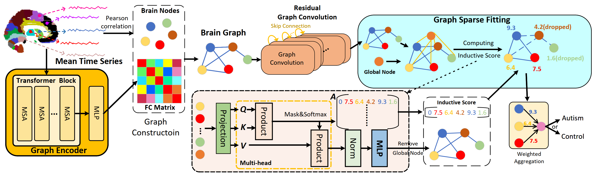

<div align="center">
<h1>Residual Graph Transformer for Autism Spectrum Disorder Prediction</h1>


[Yibin Wang](https://codegoat24.github.io)\*, Haixia Long, Tao Bo, [Jianwei Zheng](https://zhengjianwei2.github.io/)&#8224;

(&#8224;corresponding author)

[Zhejiang University of Technology]

Accepted by _**Computer Methods and Programs in Biomedicine**_

</div>

## 📖 Abstract
Brain functional connectivity (FC) based on resting-state functional magnetic resonance imaging (rs-fMRI) has been in vogue to predict Autism Spectrum Disorder (ASD), which is a neuropsychiatric disease up the plight of locating latent biomarkers for clinical diagnosis. Albeit massive endeavors have been made, most studies are fed up with several chronic issues, such as the intractability of harnessing the interaction flourishing within brain regions, the astriction of representation due to vanishing gradient within deeper network architecture, and the poor interpretability leading to unpersuasive diagnosis. To ameliorate these issues, a FC-learned Residual Graph Transformer Network, namely RGTNet, is proposed. Specifically, we design a Graph Encoder to extract temporal-related features with long-range dependencies, from which interpretable FC matrices would be modeled. Besides, the residual trick is introduced to deepen the GCN architecture, thereby learning the higher-level information. Moreover, a novel Graph Sparse Fitting followed by weighted aggregation is proposed to ease dimensionality explosion. Empirically, the results on two types of ABIDE data sets demonstrate the meliority of RGTNet. Notably, the achieved ACC metric reaches 73.4\%, overwhelming most competitors with merely 70.9\% on the AAL atlas using a five-fold cross-validation policy. Moreover, the investigated biomarkers concord closely with the authoritative medical knowledge, paving a viable way for ASD-clinical diagnosis.



## 🔧 Dataset

Please follow the [instruction](util/abide/readme.md) to download and process **ABIDE** dataset.

## 🔥 Run

```bash
python main.py --config_filename setting/abide_RGTNet.yaml
```

### Hyperparameters

All hyperparameters can be tuned in setting files.

```yaml
model:
  
  type: GraphTransformer

  # gru or cnn or attention or gau
  extractor_type: attention
  embedding_size: 8
  gcn_layer: 4
  window_size: 4

  graph_generation: product

  num_gru_layers: 4

  dropout: 0.5


train:
  # normal or bilevel 
  method: normal
  lr: 1.0e-4
  weight_decay: 1.0e-4
  epochs: 500
  pool_ratio: 0.7
  optimizer: adam
  stepsize: 200

  group_loss: true
  sparsity_loss: true
#  sparsity_loss_weight: 1.0e-4
  sparsity_loss_weight: 0.5e-4
  log_folder: /result
  
  # uniform or pearson
  pure_gnn_graph: pearson
```

## ⏬ Download the Pre-trained Models
We provide models for RGTNet_AAL and RGTNet_CC200.

<table>
  <thead>
    <tr style="text-align: right;">
      <th></th>
      <th>atlas</th>
      <th>acc.%</th>
      <th>sen.%</th>
      <th>spe.%</th>
      <th>auc.%</th>
      <th>url of model</th>
      <th></th>
    </tr>
  </thead>
  <tbody>
    <tr>
      <th>0</th>
      <td>AAL</td>
      <td>73.4</td>
      <td>70.8</td>
      <td>71.9</td>
      <td>72.3</td>
      <td><a href="https://pan.baidu.com/s/1k2xtr9OCdEiSFWrYJVXcww">baidu disk</a>&nbsp;(code: sfrp)</td>
      <td></td>
    </tr>
    <tr>
      <th>1</th>
      <td>CC200</td>
      <td>74.4</td>
      <td>75.2</td>
      <td>73.4</td>
      <td>76.0</td>
      <td><a href="https://pan.baidu.com/s/1QdI4EBKdg1IGS_XTMD9z4Q">baidu disk</a>&nbsp;(code: apmu)</td>
      <td></td>
    </tr>

  </tbody>
</table>


##  🖊️ BibTeX
If you use this repository in your research, consider citing it using the following Bibtex entry:

```
@article{RGTNet,
  title={Residual graph transformer for autism spectrum disorder prediction},
  author={Wang, Yibin and Long, Haixia and Bo, Tao and Zheng, Jianwei},
  journal={Computer Methods and Programs in Biomedicine},
  volume={247},
  pages={108065},
  year={2024},
  publisher={Elsevier}
}
```

## 📧 Contact

If you have any technical comments or questions, please open a new issue or feel free to contact [Yibin Wang](https://codegoat24.github.io).
